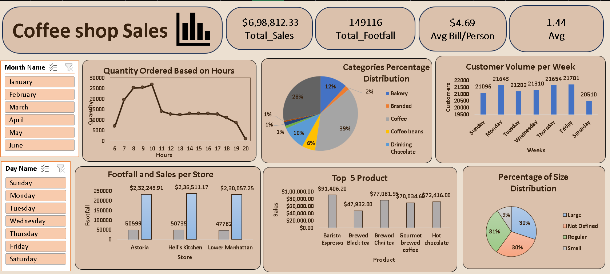

# coffee-shop-sales-analysis-excel
## 📌 Project Overview
This project is an Exploratory Data Analysis (EDA) and Dashboard project created using Microsoft Excel.  
The dashboard provides meaningful business insights from coffee shop sales data by analyzing customer behavior, sales trends, product performance, and store-wise revenue.

The main goal of this project is to transform raw sales data into interactive visual reports that help in better business decision-making.

---

# 🖼️ Dashboard Preview



---

# 🎯 Business Problem
Coffee shop businesses generate large amounts of transactional data daily.  
Without proper analysis, it becomes difficult to identify:
- Best-selling products
- Peak customer hours
- High-performing stores
- Customer purchase behavior
- Revenue trends

This project solves these problems by creating an interactive Excel dashboard.

---

# 📂 Dataset Information

The dataset contains:
- Transaction details
- Product categories
- Sales amount
- Store locations
- Order quantity
- Customer footfall
- Time and date information

---

# 🛠️ Tools & Technologies Used

| Tool | Purpose |
|------|----------|
| Microsoft Excel | Data Cleaning & Dashboard |
| Pivot Tables | Data Summarization |
| Pivot Charts | Visualization |
| Slicers | Interactive Filtering |
| Conditional Formatting | Data Highlighting |
| Excel Functions | Data Transformation |

---

# 📊 Dashboard Features

## ✅ KPI Cards
The dashboard contains important KPIs such as:
- Total Sales
- Total Footfall
- Average Bill Per Person
- Average Orders Per Person

---

## 📈 Quantity Ordered Based on Hours
- Shows customer ordering behavior by hour
- Identifies peak business timings
- Helps optimize staffing and inventory

### Insight:
Morning hours generated maximum orders.

---

## 🥧 Categories Percentage Distribution
Displays contribution of different product categories such as:
- Coffee
- Bakery
- Branded Products
- Coffee Beans
- Drinking Chocolate

### Insight:
Coffee category contributed the highest percentage of total sales.

---

## 📅 Customer Volume per Week
Analyzes customer visits across weekdays.

### Insight:
Friday and Thursday experienced the highest customer traffic.

---

## 🏪 Footfall and Sales per Store
Compares:
- Store revenue
- Customer footfall

Stores Included:
- Astoria
- Hell’s Kitchen
- Lower Manhattan

### Insight:
Hell’s Kitchen generated the highest sales among all stores.

---

## ☕ Top 5 Products
Displays the highest revenue-generating products.

### Top Products:
- Barista Espresso
- Brewed Chai Tea
- Hot Chocolate
- Gourmet Brewed Coffee

---

## 📦 Percentage of Size Distribution
Analyzes customer preference based on drink sizes:
- Large
- Regular
- Small
- Not Defined

### Insight:
Regular and Large sizes were the most preferred by customers.

---

# 📌 Key Business Insights

- Coffee products dominate total revenue contribution.
- Peak sales occur during morning business hours.
- Fridays have the highest customer volume.
- Hell’s Kitchen store performs best in overall sales.
- Espresso products are the highest-selling items.

---

# 💡 Business Recommendations

- Increase inventory during peak hours.
- Focus promotions on high-demand coffee products.
- Improve sales strategies for low-performing items.
- Offer loyalty programs during weekdays.
- Optimize staffing based on hourly customer traffic.

---

# 📁 Project Structure

```bash
Coffee-Shop-Sales-Analysis/
│
├── Coffee Shop Sales Dashboard.xlsx
├── coffee-sales-dashboard.png
└── README.md
